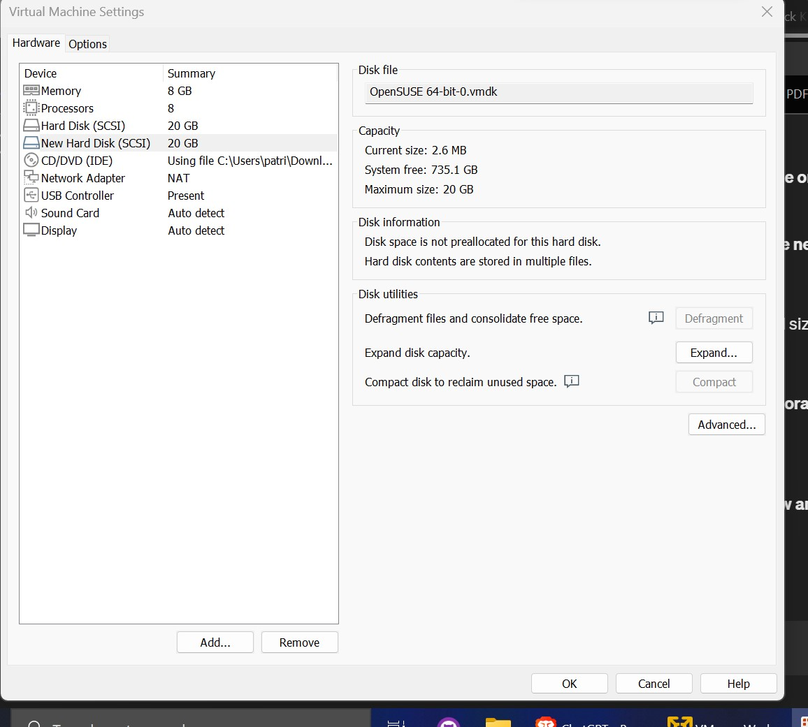
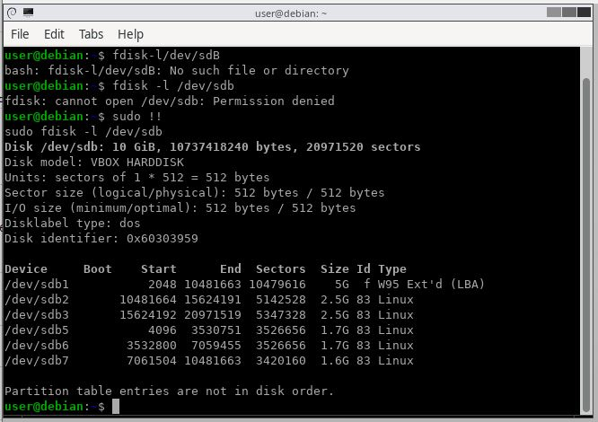

# Partitioning Quiz

## Question 1 (20 Marks)

Add a new disk to your virtual machine as explained in the instructions.

Upload a screenshot of the storage configuration of the VM shown in the VirtualBox settings.

IMPORTANT: after creating the new disk, snapshot your VM as it is easy to mess it up badly in the next parts!

### Question 1 Answer

## Question 2 (40 Marks)

MBR

After booting from the GParted CD ISO image:

1. Create an MBR (MS Dos) partition table on the new virtual disk (replacing any previous partition table).
2. Partition the disk using 2 primary partitions and an extended partition.
3. In the extended partition, create three logical partitions. Any size or format is ok for the partitions.
4. Paste in below (where X is replaced by the letter identifying your new disk):
   * the output from `fdisk -l /dev/sdX`
   * the output from `parted /dev/sdX print`
   * UPLOAD A SCREENSHOT IF YOU CAN'T COPY&PASTE FROM THE GPARTED TERMINAL.
5. Upload a screenshot of the partitioning as seen in GParted.

You can attach screenshots for item 3 above if you have problems with copy&paste from VirtualBox.

You do not need to format or specify a mount point for the partitions at this stage.

### Question 2 Answer

## Question 3

GPT

After booting from the GParted CD ISO image:

1. Create a GPT partition table on the new virtual disk (replacing any previous partition table).
2. Partition the disk with partitions of 100MB, 2GB, 3GB, and all remaining space. This is similar to a Windows default partitioning of a new disk.
3. Paste in below (where X is replaced by the letter identifying your new disk):
   * the output from "gdisk -l /dev/sdX"
   * the output from "parted /dev/sdX print"
   UPLOAD A SCREENSHOT IF YOU CAN'T COPY&PASTE FROM THE GPARTED TERMINAL.
4. Upload a screenshot of the partitioning as seen in GParted.

 You can attach screenshots for item 3 above if you have problems with copy&paste from VirtualBox.

You do not need to format or specify a mount point for the partitions at this stage.

